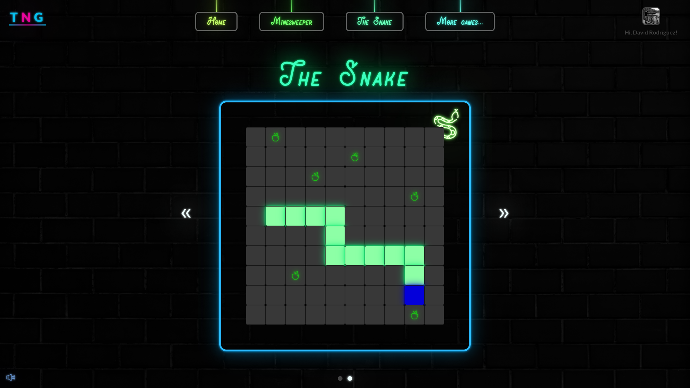

 <h1><strong>Neon Games</strong></h1> 

<strong>&nbsp;P A G E &nbsp; L I N K &nbsp;🌎</strong>

 

[Neon Games →](https://the-neon-games.herokuapp.com/)

#

<strong>&nbsp;O V E R V I E W &nbsp;👁️‍🗨️</strong>

 

Combining the 70s neon feeling, old games like the minesweeper or the snake and jazz music, this page
gives you good visual effects and a relaxing experience while you game.

It uses:
* A [Mongo](https://github.com/mongodb/mongo) database to store scores and users
* A backend in Node using [Express.js](https://github.com/expressjs/express) and [Passport.js](https://github.com/jaredhanson/passport) to handle google OAuth
* A frontend in pure [React](https://github.com/facebook/react) with declarative routing, featuring [React Router](https://github.com/remix-run/react-router) 

#

<strong>&nbsp;S C R E E N S H O T S &nbsp;📸</strong>

 

